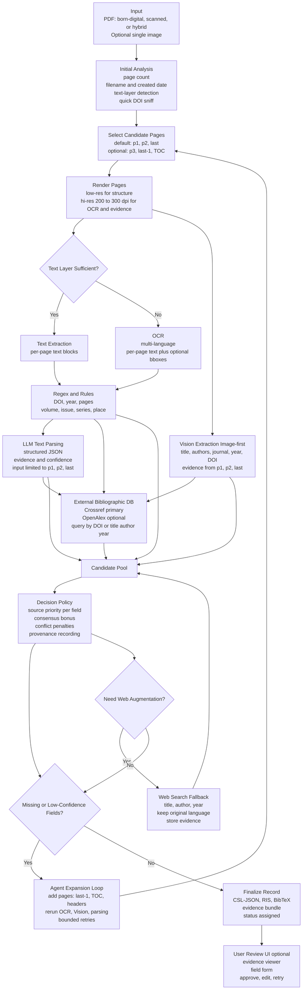

# Bibliographic Extraction Agent

본 프로젝트는 **스캔 PDF 및 텍스트 PDF**로부터 서지 정보를 자동 추출하고,
**Vision·OCR·LLM·외부 서지 DB**를 결합하여 **검증 가능한 최종 서지 레코드**를 생성하는
에이전트형 시스템의 설계 문서 모음이다.

이 시스템의 핵심 목표는 단순 자동화가 아니라,

> **왜 이 서지 정보가 선택되었는지 설명 가능한 자동 추출**

이다.

---

## 전체 구조 개요

본 시스템은 의도적으로 **두 개의 독립적인 레이어**로 구성된다.

### 1. Agent Flow (행동 레이어)

* 에이전트가 **무엇을 언제 실행하는가**를 정의
* 페이지 선택, OCR/Vision 실행, 재시도, 웹 검색 등

📄 문서: `agent-flow.md`

---

### 2. Decision Policy (판단 레이어)

* 여러 후보 중 **어떤 정보를 신뢰할 것인가**를 정의
* 출처 우선순위, confidence 계산, 충돌 해결

📄 문서: `decision-policy.md`

---

> **Agent Flow는 항상 Decision Policy를 참조해야 하며**,
> Decision Policy는 Agent Flow의 실행 순서를 정의하지 않는다.

이 분리는 유지보수성·설명 가능성·논문화 가능성을 동시에 확보하기 위한 설계 선택이다.

---

## 핵심 아이디어

### Image-first 전략

* 오래된 논문, 스캔 PDF에서는 **이미지 기반 Vision 추출**이
  OCR이나 정규식보다 신뢰도가 높다.

### Multi-source consensus

* 하나의 정보는 항상 여러 출처 후보를 가진다.
* 2개 이상 출처에서 일치할 경우 confidence가 상승한다.

### Provenance 중심 설계

* 모든 필드는 반드시 **근거(evidence)** 와 함께 저장된다.
* 자동화 결과는 항상 사용자 검수가 가능해야 한다.

---

## 워크플로우 요약 (한 줄)

> **p1/p2/last 분석 → 규칙 기반 확정 → Vision/LLM 보완 →
> 외부 DB 검증 → 확장 탐색 → 근거 저장 + 사용자 검수**

---

## 입력과 출력

### 입력

* PDF (텍스트 PDF / 스캔 PDF / 하이브리드)
* 단일 이미지 (표지, 타이틀 페이지)

### 출력

* 서지 레코드

  * CSL-JSON
  * RIS
  * BibTeX
* evidence (페이지 번호 + 텍스트/이미지 근거)
* status: `confirmed / needs_review / failed`

---

## 문서 구성

```text
docs/
 ├─ README.md              ← 본 문서
 ├─ agent-flow.md          ← 에이전트 실행 흐름
 ├─ decision-policy.md     ← 판단 규약
 ├─ (optional) confidence-model.md
 └─ (optional) vision-policy.md
```

---

## 활용 시나리오

* 로컬 CLI 기반 PDF 정리 도구
* Zotero 연동 전처리 파이프라인
* 대규모 레거시 문헌 아카이빙
* 고생물학·지질학 등 **구 논문 비중이 높은 분야 특화 시스템**

---

## 설계 철학 요약

* 자동화는 **정확성보다 설명 가능성**을 우선한다
* 실패는 오류가 아니라 하나의 상태이다
* 인간 검수는 예외가 아니라 시스템의 일부이다

---

## Status

본 문서는 **설계 스펙(specification)** 단계에 있으며,
구현은 CLI → Agent → Server 구조로 점진적 확장을 염두에 두고 있다.

---

## Figure 1. System Architecture (Mermaid)



---

(End of README.md)
